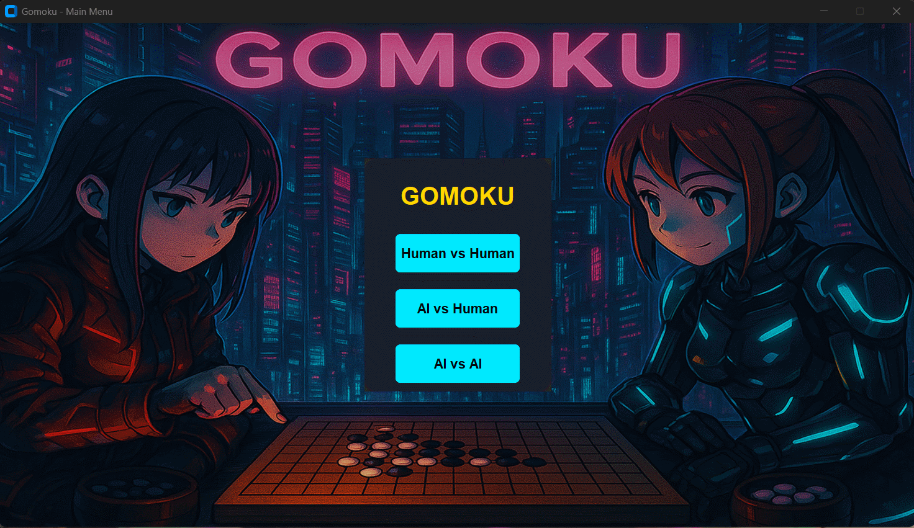

# Gomoku Game

A classic board game where players take turns placing stones on a grid, aiming to be the first to form an unbroken chain of five stones horizontally, vertically, or diagonally.
This was a project for the course **CS361: Artificial Intelligence** at **FCAI, Cairo University**.

<div align="center">
  <a href="https://count.getloli.com/"></a>
</div>

## Tech

- **Frontend**: CustomTkinter
- **AI Algorithms**: 
  - MiniMax Algorithm
  - Alpha-Beta Pruning
- **Core Libraries**:
  - Python 3.6+
  - NumPy (for AI calculations)
  - Pillow (for image processing)
  - CustomTkinter 5.2.1+

## Game Screenshot


## Requirements

- Python 3.6+
- CustomTkinter 5.2.1+
- packaging 
- pillow
- numpy (for AI calculations)

## Installation

1. Clone or download this repository:
```bash
git clone https://github.com/MegumiinUwU/Gomoku-Game.git
cd Gomoku-Game
```

2. Install the required packages:
```bash
pip install -r requirements.txt
```

## How to Play

1. Run the game:
```bash
python main.py
```

2. Game Rules:
   - Black always plays first
   - Players take turns placing stones on intersections of the grid
   - The first player to form an unbroken row of five stones wins
   - If the board is filled without a winner, the game is a draw
   - No moves can be made after a player has won or the game is drawn

## Controls

- Click on the board to place a stone
- Use the "New Game" button to reset the game
- Use the "Undo Move" button to take back the last move
- Use the "Main Menu" button to return to the main menu

## Game Modes

The game supports various different modes:
- Human vs Human: Two players taking turns
- AI vs Human: 
  - Play against the MiniMax algorithm
  - Play against the Alpha-Beta pruning algorithm
- AI vs AI: 
  - Watch MiniMax play against Alpha-Beta pruning
  - Watch Alpha-Beta pruning play against itself

## AI Implementation

The game includes two AI algorithms:

1. **MiniMax Algorithm**: A traditional recursive algorithm that explores all possible game states to find the optimal move, considering all possible counter-moves from the opponent.

2. **Alpha-Beta Pruning**: An optimization of the MiniMax algorithm that eliminates branches that cannot influence the final decision, which results in faster computation while maintaining the same results.

Both algorithms evaluate the board based on patterns of consecutive stones, potential threats, and possible winning configurations.


## BONUS Optimization

The game includes an optimized version of the AI algorithms in `ai_2.py`. To use this optimized version, simply change the import in `gui.py` from `from ai import get_best_move` to `from ai_2 import get_best_move`. The optimized version includes several performance improvements:

1. **Transposition Table**: Caches evaluated positions to avoid recalculating the same board states
2. **Iterative Deepening**: Gradually increases search depth while respecting time limits
3. **Move Ordering**: Prioritizes promising moves to improve alpha-beta pruning efficiency
4. **In-place Operations**: Uses make_move/undo_move instead of copying board states
5. **Early Game Optimizations**: Special handling for first and second moves
6. **Time Management**: Enforces time limits to ensure responsive gameplay
7. **Move Counter**: Tracks number of positions evaluated for performance monitoring

These optimizations can significantly improve the AI's performance, especially in complex positions, while maintaining the same strategic quality of play.


## License

This project is open source and available under the MIT License. 

